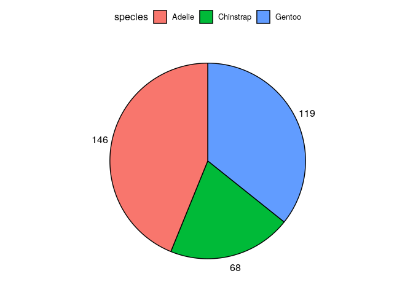
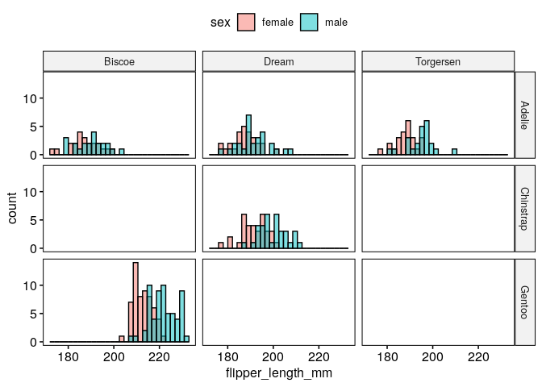
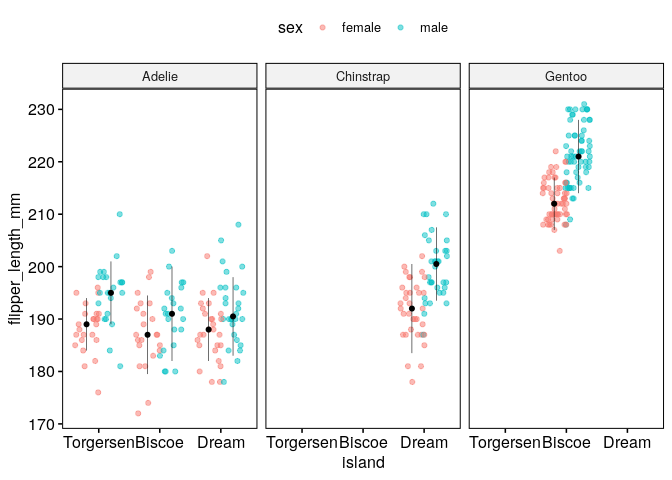
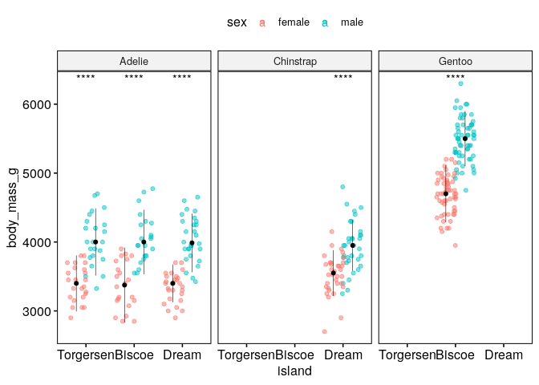
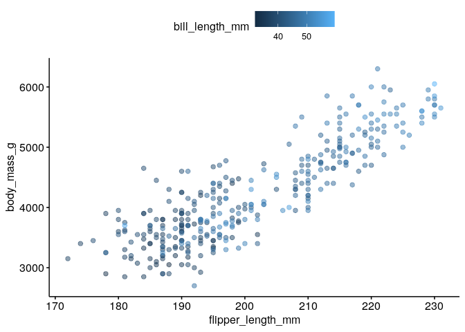
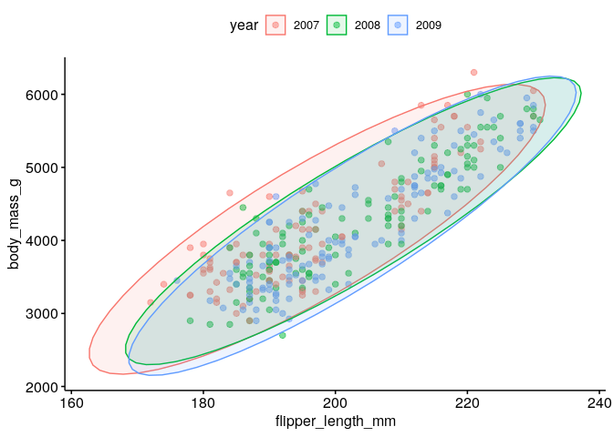
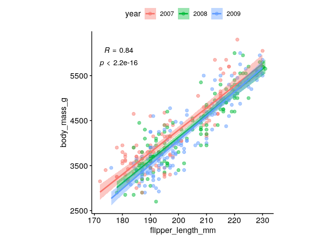
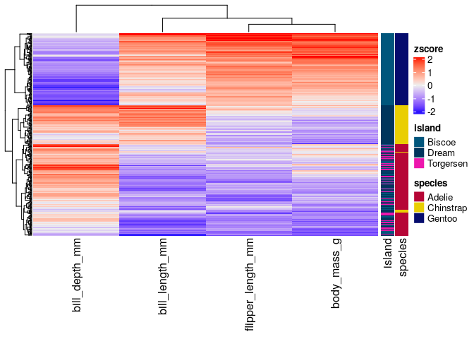

Get started
===========

Load data
=========

To start playing around with the functions from these packages we will
use the
[`palmerpenguins`](https://allisonhorst.github.io/palmerpenguins/articles/intro.html)
data set. This simple data set has both continuous and categorical
variables that make it perfect for showcasing how different functions
work.

    require(tidyverse)

    penguins_url = "https://raw.githubusercontent.com/allisonhorst/palmerpenguins/master/inst/extdata/penguins.csv"
    dat = read_csv(url(penguins_url))
    dat = dat %>% drop_na()
    head(dat)

    ## # A tibble: 6 × 8
    ##   species island bill_length_mm bill_depth_mm flipper_length_… body_mass_g sex  
    ##   <chr>   <chr>           <dbl>         <dbl>            <dbl>       <dbl> <chr>
    ## 1 Adelie  Torge…           39.1          18.7              181        3750 male 
    ## 2 Adelie  Torge…           39.5          17.4              186        3800 fema…
    ## 3 Adelie  Torge…           40.3          18                195        3250 fema…
    ## 4 Adelie  Torge…           36.7          19.3              193        3450 fema…
    ## 5 Adelie  Torge…           39.3          20.6              190        3650 male 
    ## 6 Adelie  Torge…           38.9          17.8              181        3625 fema…
    ## # … with 1 more variable: year <dbl>

General plotting with `ggpubr`
==============================

    require(ggpubr)

`ggpubr` allows to make insightful plots quickly for exploration that in
turn can be further customized thanks to being built on top of
`ggplot2`.

These are useful links for using this package:

-   [function
    reference](http://rpkgs.datanovia.com/ggpubr/reference/index.html)
-   [palettes](http://rpkgs.datanovia.com/ggpubr/reference/get_palette.html)
-   [figure
    making](http://rpkgs.datanovia.com/ggpubr/reference/ggarrange.html)

Next, we will try to answer different questions using this library and
`ggplot2`.

How many penguins of each species did we observe in total?
----------------------------------------------------------

    ggpie(dat %>% count(species), x = "n", fill = "species")

How many penguins of each species and sex did we observe across the different islands?
--------------------------------------------------------------------------------------

    ggbarplot(dat %>% count(species, sex, island), x = "species", y = "n", fill = "sex", 
              label = TRUE, position = position_dodge(0.7), facet.by = "island", palette = "lancet")

What are the distributions of flipper lengths considering penguin species, sex and islands of origin?
-----------------------------------------------------------------------------------------------------

    gghistogram(dat, x = "flipper_length_mm", fill = "sex", facet.by = c("species","island"))

Alternatively, we can use stripcharts charts:

    ggstripchart(dat, x = "island", y = "flipper_length_mm", color = "sex", facet.by = "species", alpha = 0.5, position = position_jitterdodge(), add = "median_iqr", add.params = list(color="black", group="sex", size=0.2))

Are the differences of body mass between sexes significant if we control for species and island?
------------------------------------------------------------------------------------------------

    ggstripchart(dat, x = "island", y = "body_mass_g", color = "sex", facet.by = "species", alpha = 0.5, position = position_jitterdodge(), add = "median_iqr", add.params = list(color="black", group="sex", size=0.2))+
       stat_compare_means(aes(color = sex), label = "p.signif", method = "wilcox.test")

What is the relationship between flipper length, body mass and bill length?
---------------------------------------------------------------------------

    ggscatter(dat, x = "flipper_length_mm", y = "body_mass_g", color = "bill_length_mm", alpha = 0.5)

Could we have sampling bias in the relationship between flipper length and body mass?
-------------------------------------------------------------------------------------

    ggscatter(dat %>% mutate(year=factor(year)), x = "flipper_length_mm", y = "body_mass_g", alpha = 0.5, color = "year", ellipse = TRUE)

What is the spearman correlation coefficient between body mass and flipper length?
----------------------------------------------------------------------------------

    ggscatter(dat %>% mutate(year=factor(year)), x = "flipper_length_mm", y = "body_mass_g", alpha = 0.5, color = "year", 
              add = "reg.line", conf.int = TRUE, 
              cor.coef = TRUE,
              cor.coeff.args = list(method = "spearman", label.sep = "\n")) + 
       theme(aspect.ratio = 1)

Create and save a figure
------------------------

    fontsize = 6
    labsize = 2

    # overview number of observations of every sex across islands and species
    p1 = ggbarplot(dat %>% count(species, sex, island), x = "species", y = "n", fill = "sex", 
                   label = TRUE, lab.size = labsize,
                   position = position_dodge(0.7), facet.by = "island", palette = "lancet") + 
       ylim(NA, 68)

    # sex-related body mass distributions across islands and species
    p2 = ggstripchart(dat, x = "island", y = "body_mass_g", color = "sex", facet.by = "species", 
                      alpha = 0.5, position = position_jitterdodge(), add = "median_iqr", 
                      add.params = list(color="black", group="sex", size=0.2),
                      palette = "lancet")+
                stat_compare_means(aes(color = sex), label = "p.signif", method = "wilcox.test", size = labsize)

    # association of flipper length and body mass
    p3 = ggscatter(dat %>% mutate(year=factor(year)), x = "flipper_length_mm", y = "body_mass_g", alpha = 0.5, color = "year", 
              add = "reg.line", conf.int = TRUE, 
              cor.coef = TRUE,
              cor.coeff.args = list(method = "spearman", label.sep = "\n", size = labsize)) + 
       theme(aspect.ratio = 1)

    p1p2 = ggarrange(p1 + theme_pubr(base_size = fontsize), p2 + theme_pubr(base_size = fontsize), ncol = 1, common.legend = TRUE)
    fig = ggarrange(p1p2, p3 + theme_pubr(base_size = fontsize), widths = c(2,1), heights = c(2, 1), labels = "AUTO")

    # save
    ggsave("images/myfig.png", fig, width = 15, height = 10, unit = "cm")

Heatmaps with `ComplexHeatmap`
==============================

A part from `ggpubr`, one of the most common packages to visualize
multiple types of data altogether is `ComplexHeatmap`, which allows to
combine hierarchical clustering of rows and columns with continuous and
categorical data.

    require(ComplexHeatmap)
    # we are only interested in numeric columns
    cols_oi = c("bill_length_mm","bill_depth_mm","flipper_length_mm","body_mass_g")
    rownames(dat) = 1:nrow(dat)

    # we need to add as.data.frame() because "dat" is a tibble,
    # which differ in the way they handle data underlying data types
    annotation_row = HeatmapAnnotation(df=dat[,c("island","species")] %>% as.data.frame(),
                                       name="metadata_row",
                                       which="row")

    mat = dat[,cols_oi] %>% as.matrix()
    mat = scale(mat)
    Heatmap(mat, 
            name="zscore",
            show_row_names = FALSE, 
            right_annotation = annotation_row)

References
==========

-   [`ggplot2`](https://ggplot2.tidyverse.org/)
-   [`ggpubr`](https://rpkgs.datanovia.com/ggpubr/)
-   [`ComplexHeatmap`](http://bioconductor.org/packages/release/bioc/html/ComplexHeatmap.html)

Session Info
============

    sessionInfo()

    ## R version 4.1.2 (2021-11-01)
    ## Platform: x86_64-pc-linux-gnu (64-bit)
    ## Running under: Ubuntu 18.04.6 LTS
    ## 
    ## Matrix products: default
    ## BLAS:   /usr/lib/x86_64-linux-gnu/openblas/libblas.so.3
    ## LAPACK: /usr/lib/x86_64-linux-gnu/libopenblasp-r0.2.20.so
    ## 
    ## locale:
    ##  [1] LC_CTYPE=en_US.UTF-8       LC_NUMERIC=C              
    ##  [3] LC_TIME=en_GB.UTF-8        LC_COLLATE=en_US.UTF-8    
    ##  [5] LC_MONETARY=en_GB.UTF-8    LC_MESSAGES=en_US.UTF-8   
    ##  [7] LC_PAPER=en_GB.UTF-8       LC_NAME=C                 
    ##  [9] LC_ADDRESS=C               LC_TELEPHONE=C            
    ## [11] LC_MEASUREMENT=en_GB.UTF-8 LC_IDENTIFICATION=C       
    ## 
    ## attached base packages:
    ## [1] grid      stats     graphics  grDevices utils     datasets  methods  
    ## [8] base     
    ## 
    ## other attached packages:
    ##  [1] ComplexHeatmap_2.10.0 ggpubr_0.4.0          forcats_0.5.1        
    ##  [4] stringr_1.4.0         dplyr_1.0.8           purrr_0.3.4          
    ##  [7] readr_2.1.2           tidyr_1.2.0           tibble_3.1.6         
    ## [10] ggplot2_3.3.5         tidyverse_1.3.1      
    ## 
    ## loaded via a namespace (and not attached):
    ##  [1] nlme_3.1-155        matrixStats_0.61.0  fs_1.5.2           
    ##  [4] lubridate_1.8.0     bit64_4.0.5         RColorBrewer_1.1-2 
    ##  [7] doParallel_1.0.17   httr_1.4.2          ggsci_2.9          
    ## [10] tools_4.1.2         backports_1.4.1     utf8_1.2.2         
    ## [13] R6_2.5.1            BiocGenerics_0.40.0 DBI_1.1.2          
    ## [16] mgcv_1.8-39         colorspace_2.0-3    GetoptLong_1.0.5   
    ## [19] withr_2.5.0         tidyselect_1.1.2    gridExtra_2.3      
    ## [22] bit_4.0.4           compiler_4.1.2      cli_3.2.0          
    ## [25] rvest_1.0.2         xml2_1.3.3          labeling_0.4.2     
    ## [28] scales_1.1.1        digest_0.6.29       rmarkdown_2.12     
    ## [31] pkgconfig_2.0.3     htmltools_0.5.2     dbplyr_2.1.1       
    ## [34] fastmap_1.1.0       highr_0.9           GlobalOptions_0.1.2
    ## [37] rlang_1.0.2         readxl_1.3.1        rstudioapi_0.13    
    ## [40] shape_1.4.6         farver_2.1.0        generics_0.1.2     
    ## [43] jsonlite_1.8.0      vroom_1.5.7         car_3.0-12         
    ## [46] magrittr_2.0.2      Matrix_1.4-0        S4Vectors_0.32.3   
    ## [49] Rcpp_1.0.8          munsell_0.5.0       fansi_1.0.2        
    ## [52] abind_1.4-5         lifecycle_1.0.1     stringi_1.7.6      
    ## [55] yaml_2.3.5          carData_3.0-5       parallel_4.1.2     
    ## [58] crayon_1.5.0        lattice_0.20-45     haven_2.4.3        
    ## [61] cowplot_1.1.1       splines_4.1.2       circlize_0.4.14    
    ## [64] hms_1.1.1           knitr_1.37          pillar_1.7.0       
    ## [67] rjson_0.2.21        ggsignif_0.6.3      stats4_4.1.2       
    ## [70] codetools_0.2-18    reprex_2.0.1        glue_1.6.2         
    ## [73] evaluate_0.15       modelr_0.1.8        vctrs_0.3.8        
    ## [76] png_0.1-7           tzdb_0.2.0          foreach_1.5.2      
    ## [79] cellranger_1.1.0    gtable_0.3.0        clue_0.3-60        
    ## [82] assertthat_0.2.1    xfun_0.30           broom_0.7.12       
    ## [85] rstatix_0.7.0       iterators_1.0.14    IRanges_2.28.0     
    ## [88] cluster_2.1.2       ellipsis_0.3.2
