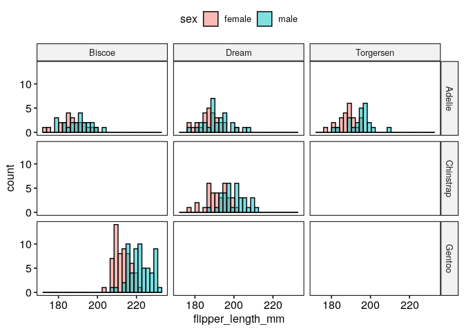
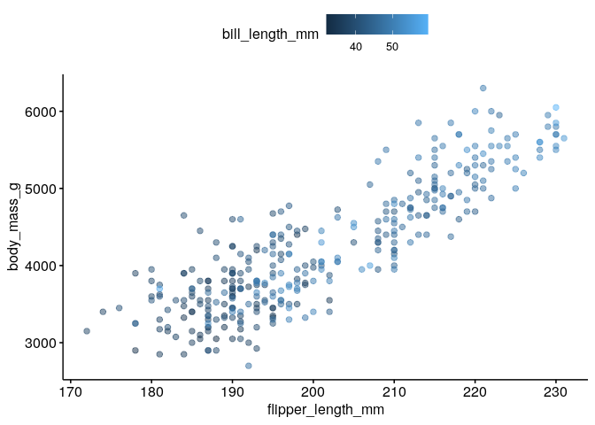
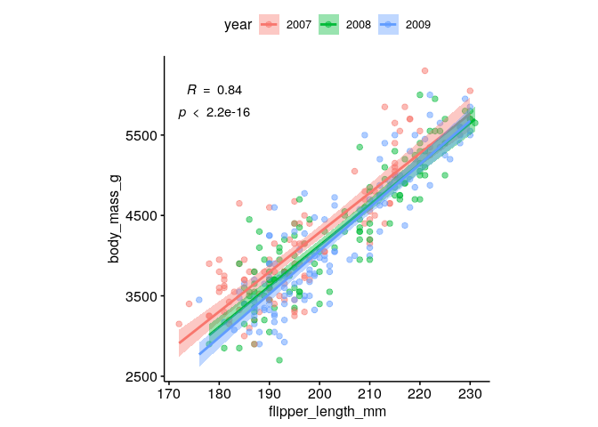
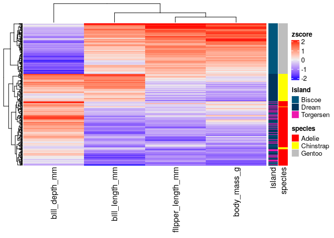

# Get started

# Load data

To start playing around with the functions from these packages we will
use the
[`palmerpenguins`](https://allisonhorst.github.io/palmerpenguins/articles/intro.html)
data set. This simple data set has both continuous and categorical
variables that make it perfect for showcasing how different functions
work.

    require(tidyverse)

    penguins_url = "https://raw.githubusercontent.com/allisonhorst/palmerpenguins/master/inst/extdata/penguins.csv"
    dat = read_csv(url(penguins_url))
    dat = dat %>% drop_na()
    head(dat)

    ## # A tibble: 6 × 8
    ##   species island    bill_length_mm bill_depth_mm flipper_length_mm body_mass_g
    ##   <chr>   <chr>              <dbl>         <dbl>             <dbl>       <dbl>
    ## 1 Adelie  Torgersen           39.1          18.7               181        3750
    ## 2 Adelie  Torgersen           39.5          17.4               186        3800
    ## 3 Adelie  Torgersen           40.3          18                 195        3250
    ## 4 Adelie  Torgersen           36.7          19.3               193        3450
    ## 5 Adelie  Torgersen           39.3          20.6               190        3650
    ## 6 Adelie  Torgersen           38.9          17.8               181        3625
    ## # ℹ 2 more variables: sex <chr>, year <dbl>

# General plotting with `ggpubr`

    require(ggpubr)

`ggpubr` allows to make insightful plots quickly for exploration that in
turn can be further customized thanks to being built on top of
`ggplot2`.

These are useful links for using this package:

-   [function
    reference](http://rpkgs.datanovia.com/ggpubr/reference/index.html)
-   [palettes](http://rpkgs.datanovia.com/ggpubr/reference/get_palette.html)
-   [figure
    making](http://rpkgs.datanovia.com/ggpubr/reference/ggarrange.html)

Next, we will try to answer different questions using this library and
`ggplot2`.

## How many penguins of each species did we observe in total?

    ggpie(dat %>% count(species), x = "n", fill = "species")

## How many penguins of each species and sex did we observe across the different islands?

    ggbarplot(dat %>% count(species, sex, island), x = "species", y = "n", fill = "sex", 
              label = TRUE, position = position_dodge(0.7), facet.by = "island", palette = "lancet")

## What are the distributions of flipper lengths considering penguin species, sex and islands of origin?

    gghistogram(dat, x = "flipper_length_mm", fill = "sex", facet.by = c("species","island"))

Alternatively, we can use stripcharts charts:

    ggstripchart(dat, x = "island", y = "flipper_length_mm", color = "sex", facet.by = "species", alpha = 0.5, position = position_jitterdodge(), add = "median_iqr", add.params = list(color="black", group="sex", size=0.2))

## Are the differences of body mass between sexes significant if we control for species and island?

    ggstripchart(dat, x = "island", y = "body_mass_g", color = "sex", facet.by = "species", alpha = 0.5, position = position_jitterdodge(), add = "median_iqr", add.params = list(color="black", group="sex", size=0.2))+
       stat_compare_means(aes(color = sex), label = "p.signif", method = "wilcox.test")

## What is the relationship between flipper length, body mass and bill length?

    ggscatter(dat, x = "flipper_length_mm", y = "body_mass_g", color = "bill_length_mm", alpha = 0.5)

## Could we have sampling bias in the relationship between flipper length and body mass?

    ggscatter(dat %>% mutate(year=factor(year)), x = "flipper_length_mm", y = "body_mass_g", alpha = 0.5, color = "year", ellipse = TRUE)

## What is the spearman correlation coefficient between body mass and flipper length?

    ggscatter(dat %>% mutate(year=factor(year)), x = "flipper_length_mm", y = "body_mass_g", alpha = 0.5, color = "year", 
              add = "reg.line", conf.int = TRUE, 
              cor.coef = TRUE,
              cor.coeff.args = list(method = "spearman", label.sep = "\n")) + 
       theme(aspect.ratio = 1)

## Create and save a figure

    fontsize = 6
    labsize = 2

    # overview number of observations of every sex across islands and species
    p1 = ggbarplot(dat %>% count(species, sex, island), x = "species", y = "n", fill = "sex", 
                   label = TRUE, lab.size = labsize,
                   position = position_dodge(0.7), facet.by = "island", palette = "lancet") + 
       ylim(NA, 68)

    # sex-related body mass distributions across islands and species
    p2 = ggstripchart(dat, x = "island", y = "body_mass_g", color = "sex", facet.by = "species", 
                      alpha = 0.5, position = position_jitterdodge(), add = "median_iqr", 
                      add.params = list(color="black", group="sex", size=0.2),
                      palette = "lancet")+
                stat_compare_means(aes(color = sex), label = "p.signif", method = "wilcox.test", size = labsize)

    # association of flipper length and body mass
    p3 = ggscatter(dat %>% mutate(year=factor(year)), x = "flipper_length_mm", y = "body_mass_g", alpha = 0.5, color = "year", 
              add = "reg.line", conf.int = TRUE, 
              cor.coef = TRUE,
              cor.coeff.args = list(method = "spearman", label.sep = "\n", size = labsize)) + 
       theme(aspect.ratio = 1)

    p1p2 = ggarrange(p1 + theme_pubr(base_size = fontsize), p2 + theme_pubr(base_size = fontsize), ncol = 1, common.legend = TRUE)
    fig = ggarrange(p1p2, p3 + theme_pubr(base_size = fontsize), widths = c(2,1), heights = c(2, 1), labels = "AUTO")

    # save
    ggsave("images/myfig.png", fig, width = 15, height = 10, unit = "cm")

# Heatmaps with `ComplexHeatmap`

A part from `ggpubr`, one of the most common packages to visualize
multiple types of data altogether is `ComplexHeatmap`, which allows to
combine hierarchical clustering of rows and columns with continuous and
categorical data.

    require(ComplexHeatmap)
    # we are only interested in numeric columns
    cols_oi = c("bill_length_mm","bill_depth_mm","flipper_length_mm","body_mass_g")
    rownames(dat) = 1:nrow(dat)

    # we need to add as.data.frame() because "dat" is a tibble,
    # which differ in the way they handle data underlying data types
    # we can customize the color for each species
    colors_species = c("Adelie"="red", "Chinstrap"="yellow", "Gentoo"="grey")
    colors_annot = list(species=colors_species)
    annotation_row = HeatmapAnnotation(df=dat[,c("island","species")] %>% as.data.frame(),
                                       name="metadata_row",
                                       which="row",
                                       col = colors_annot)

    mat = dat[,cols_oi] %>% as.matrix()
    mat = scale(mat)
    Heatmap(mat, 
            name="zscore",
            show_row_names = FALSE, 
            right_annotation = annotation_row)

# References

-   [`ggplot2`](https://ggplot2.tidyverse.org/)
-   [`ggpubr`](https://rpkgs.datanovia.com/ggpubr/)
-   [`ComplexHeatmap`](http://bioconductor.org/packages/release/bioc/html/ComplexHeatmap.html)

# Session Info

    sessionInfo()

    ## R version 4.3.1 (2023-06-16)
    ## Platform: x86_64-pc-linux-gnu (64-bit)
    ## Running under: Ubuntu 18.04.6 LTS
    ## 
    ## Matrix products: default
    ## BLAS:   /usr/lib/x86_64-linux-gnu/openblas/libblas.so.3 
    ## LAPACK: /usr/lib/x86_64-linux-gnu/libopenblasp-r0.2.20.so;  LAPACK version 3.7.1
    ## 
    ## locale:
    ##  [1] LC_CTYPE=en_US.UTF-8       LC_NUMERIC=C              
    ##  [3] LC_TIME=es_ES.UTF-8        LC_COLLATE=en_US.UTF-8    
    ##  [5] LC_MONETARY=es_ES.UTF-8    LC_MESSAGES=en_US.UTF-8   
    ##  [7] LC_PAPER=es_ES.UTF-8       LC_NAME=C                 
    ##  [9] LC_ADDRESS=C               LC_TELEPHONE=C            
    ## [11] LC_MEASUREMENT=es_ES.UTF-8 LC_IDENTIFICATION=C       
    ## 
    ## time zone: Europe/Madrid
    ## tzcode source: system (glibc)
    ## 
    ## attached base packages:
    ## [1] grid      stats     graphics  grDevices utils     datasets  methods  
    ## [8] base     
    ## 
    ## other attached packages:
    ##  [1] ComplexHeatmap_2.9.3 ggpubr_0.4.0         lubridate_1.9.2     
    ##  [4] forcats_1.0.0        stringr_1.5.1        dplyr_1.1.1         
    ##  [7] purrr_0.3.4          readr_2.1.5          tidyr_1.2.1         
    ## [10] tibble_3.2.1         ggplot2_3.5.0        tidyverse_2.0.0     
    ## 
    ## loaded via a namespace (and not attached):
    ##  [1] tidyselect_1.2.1    farver_2.1.1        fastmap_1.1.1      
    ##  [4] digest_0.6.29       timechange_0.3.0    lifecycle_1.0.4    
    ##  [7] cluster_2.1.4       ellipsis_0.3.2      Cairo_1.6-1        
    ## [10] magrittr_2.0.3      compiler_4.3.1      rlang_1.1.0        
    ## [13] tools_4.3.1         utf8_1.2.4          yaml_2.3.8         
    ## [16] knitr_1.45          ggsignif_0.6.4      labeling_0.4.3     
    ## [19] bit_4.0.5           RColorBrewer_1.1-3  abind_1.4-5        
    ## [22] withr_3.0.0         BiocGenerics_0.48.1 stats4_4.3.1       
    ## [25] fansi_1.0.3         colorspace_2.0-3    scales_1.3.0       
    ## [28] iterators_1.0.14    cli_3.4.0           rmarkdown_2.26     
    ## [31] crayon_1.5.2        ragg_1.3.0          generics_0.1.3     
    ## [34] tzdb_0.3.0          rjson_0.2.21        splines_4.3.1      
    ## [37] parallel_4.3.1      matrixStats_1.0.0   vctrs_0.6.1        
    ## [40] Matrix_1.6-5        carData_3.0-5       car_3.1-2          
    ## [43] S4Vectors_0.40.1    IRanges_2.30.1      hms_1.1.3          
    ## [46] GetoptLong_1.0.5    bit64_4.0.5         rstatix_0.7.2      
    ## [49] clue_0.3-65         magick_2.8.3        systemfonts_1.0.6  
    ## [52] foreach_1.5.2       glue_1.6.2          codetools_0.2-19   
    ## [55] cowplot_1.1.3       shape_1.4.6.1       stringi_1.7.8      
    ## [58] gtable_0.3.4        munsell_0.5.0       pillar_1.9.0       
    ## [61] htmltools_0.5.7     circlize_0.4.16     R6_2.5.1           
    ## [64] textshaping_0.3.7   doParallel_1.0.17   vroom_1.6.5        
    ## [67] evaluate_0.23       lattice_0.21-8      highr_0.10         
    ## [70] png_0.1-8           backports_1.4.1     broom_1.0.5        
    ## [73] ggsci_3.0.1         Rcpp_1.0.8.3        gridExtra_2.3      
    ## [76] nlme_3.1-164        mgcv_1.9-0          xfun_0.42          
    ## [79] pkgconfig_2.0.3     GlobalOptions_0.1.2
