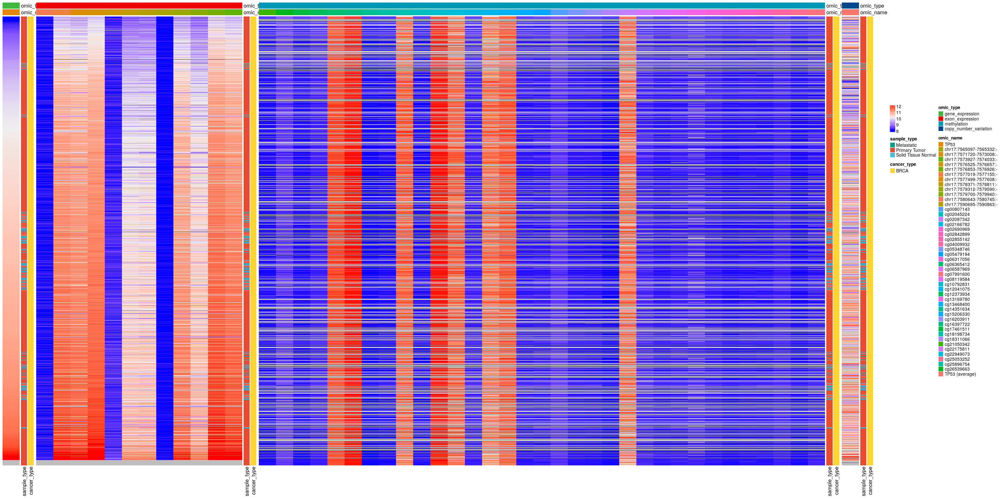

Exploratory Data Analysis of the most popular human gene
========================================================

Data
====

``` r
require(tidyverse)
require(ggpubr)
require(ComplexHeatmap)

ROOT = here::here()
```

Description
-----------

According to this [article](https://www.nature.com/articles/d41586-017-07291-9), *TP53* is the most popular gene in the human genome by far. In the practical part of the talk, we will all dive into pubicly available data on this gene.

We collected harmonized multi-omic data from the XenaBrowser's [TCGA Pan Cancer (PANCAN) dataset](https://xenabrowser.net/datapages/?cohort=TCGA%20Pan-Cancer%20(PANCAN)&removeHub=https%3A%2F%2Fxena.treehouse.gi.ucsc.edu%3A443):

-   Gene expression: log2(norm\_value+1)
-   Exon expression: log2(RPKM+1)
-   Gene methylation 450k: beta value
-   Copy Number Variation: log( tumor / normal )
-   Mutations

Additionally, we downloaded a protein Multiple Sequence Alignment (MSA) of 153 *TP53* mammal orthologues from [NCBI](https://www.ncbi.nlm.nih.gov/), generated through their aligner [COBALT](https://www.ncbi.nlm.nih.gov/gene/7157/ortholog/?scope=40674).

Overview
--------

The pre-processed data sets can be found in `data/prep`.

``` r
omics = read_tsv(file.path(ROOT,'data','prep','data_multiomics.tsv.gz'))
muts = read_tsv(file.path(ROOT,'data','prep','data_somatic_mutations.tsv.gz'))
```

The data sets contain data on all these cancer types:

``` r
omics %>% distinct(cancer_type) %>% pull()
```

    ##  [1] "GBM"  "OV"   "LUAD" "LUSC" "PRAD" "UCEC" "BLCA" "TGCT" "ESCA" "PAAD"
    ## [11] "KIRP" "LIHC" "CESC" "SARC" "BRCA" "THYM" "MESO" "COAD" "STAD" "SKCM"
    ## [21] "CHOL" "KIRC" "THCA" "HNSC" "LAML" "READ" "LGG"  "DLBC" "KICH" "UCS" 
    ## [31] "ACC"  "PCPG" "UVM"

I pre-processed different omic data sets into a long format data frame in which every "value" is linked to an "omic\_type", which in turn can have several "omic\_names". Additionally, we added information on the sample metadata.

``` r
# available variables
colnames(omics)
```

    ##  [1] "sample"                              "omic_name"                          
    ##  [3] "value"                               "omic_type"                          
    ##  [5] "_primary_disease"                    "age_at_initial_pathologic_diagnosis"
    ##  [7] "clinical_stage"                      "gender"                             
    ##  [9] "histological_grade"                  "histological_type"                  
    ## [11] "OS"                                  "OS.time"                            
    ## [13] "residual_tumor"                      "sample_type"                        
    ## [15] "tumor_status"                        "_PATIENT"                           
    ## [17] "cancer_type"

``` r
# omic data types
omics %>% group_by(omic_type) %>% count()
```

    ## # A tibble: 4 × 2
    ## # Groups:   omic_type [4]
    ##   omic_type                  n
    ##   <chr>                  <int>
    ## 1 copy_number_variation  10873
    ## 2 exon_expression       125508
    ## 3 gene_expression        11060
    ## 4 methylation           318050

In the cases of exon expression and methylation, there are multiple "omic\_name"s that correspond to different exons and methylation sites.

``` r
# exons
omics %>% filter(omic_type=='exon_expression') %>% distinct(omic_name) %>% pull()
```

    ##  [1] "chr17:7580643-7580745:-" "chr17:7577019-7577155:-"
    ##  [3] "chr17:7577499-7577608:-" "chr17:7571720-7573008:-"
    ##  [5] "chr17:7576525-7576657:-" "chr17:7578371-7578811:-"
    ##  [7] "chr17:7590695-7590863:-" "chr17:7565097-7565332:-"
    ##  [9] "chr17:7579312-7579590:-" "chr17:7579700-7579940:-"
    ## [11] "chr17:7576853-7576926:-" "chr17:7573927-7574033:-"

``` r
# methylation sites
omics %>% filter(omic_type=='methylation') %>% distinct(omic_name) %>% pull()
```

    ##  [1] "cg21050342" "cg26539663" "cg17461511" "cg12373934" "cg06365412"
    ##  [6] "cg16397722" "cg14351634" "cg25896754" "cg18198734" "cg02045224"
    ## [11] "cg10792831" "cg22949073" "cg02166782" "cg12041075" "cg13468400"
    ## [16] "cg15206330" "cg05479194" "cg00807143" "cg05348746" "cg16203911"
    ## [21] "cg18311066" "cg02087342" "cg22175811" "cg06587969" "cg08119584"
    ## [26] "cg13169780" "cg06317056" "cg02690969" "cg02842899" "cg02855142"
    ## [31] "cg04009932" "cg25053252" "cg07991600"

Then, the mutations data set is structured as a list of mutations that occur inthis gene in every sample:

``` r
colnames(muts)
```

    ##  [1] "sample"                              "chr"                                
    ##  [3] "start"                               "end"                                
    ##  [5] "gene"                                "reference"                          
    ##  [7] "alt"                                 "altGene"                            
    ##  [9] "effect"                              "aminoAcid"                          
    ## [11] "rnaVaf"                              "dnaVaf"                             
    ## [13] "_primary_disease"                    "age_at_initial_pathologic_diagnosis"
    ## [15] "clinical_stage"                      "gender"                             
    ## [17] "histological_grade"                  "histological_type"                  
    ## [19] "OS"                                  "OS.time"                            
    ## [21] "residual_tumor"                      "sample_type"                        
    ## [23] "tumor_status"                        "_PATIENT"                           
    ## [25] "cancer_type"

``` r
muts %>% drop_na(effect)
```

    ## # A tibble: 9,104 × 25
    ##    sample       chr   start end   gene  reference alt   altGene effect aminoAcid
    ##    <chr>        <chr> <chr> <chr> <chr> <chr>     <chr> <chr>   <chr>  <chr>    
    ##  1 TCGA-02-000… chr17 7577… 7577… TP53  G         A     <NA>    Misse… p.R282W  
    ##  2 TCGA-02-003… chr17 7577… 7577… TP53  C         T     <NA>    Misse… p.R248Q  
    ##  3 TCGA-02-004… no v… no v… no v… no v… no varia… no v… no var… no va… no varia…
    ##  4 TCGA-02-005… chr17 7578… 7578… TP53  C         T     <NA>    Misse… p.V216M  
    ##  5 TCGA-02-247… no v… no v… no v… no v… no varia… no v… no var… no va… no varia…
    ##  6 TCGA-02-248… chr17 7577… 7577… TP53  C         T     <NA>    Misse… p.R273H  
    ##  7 TCGA-02-248… chr17 7577… 7577… TP53  C         T     <NA>    Misse… p.R248Q  
    ##  8 TCGA-02-248… no v… no v… no v… no v… no varia… no v… no var… no va… no varia…
    ##  9 TCGA-04-135… no v… no v… no v… no v… no varia… no v… no var… no va… no varia…
    ## 10 TCGA-04-136… chr17 7577… 7577… TP53  C         A     <NA>    Misse… p.R280I  
    ## # … with 9,094 more rows, and 15 more variables: rnaVaf <chr>, dnaVaf <chr>,
    ## #   `_primary_disease` <chr>, age_at_initial_pathologic_diagnosis <chr>,
    ## #   clinical_stage <chr>, gender <chr>, histological_grade <chr>,
    ## #   histological_type <chr>, OS <chr>, OS.time <dbl>, residual_tumor <chr>,
    ## #   sample_type <chr>, tumor_status <chr>, `_PATIENT` <chr>, cancer_type <chr>

Exploratory Data Analysis
=========================

In this section, we will try to answer the questions using functions from the packages introduced previously. These solutions are completely subjective, so feel free to find your own best ways of combining and visualizing the different types of data.

Counting
--------

### How many samples per cancer type are there?

``` r
ggbarplot(omics %>% group_by(cancer_type) %>% count(), x = 'cancer_type', y = 'n', 
          fill = 'cancer_type',
          ggtheme = theme_pubr(x.text.angle = 50, base_size = 10))
```


### How many samples per cancer type and sample type are there?

``` r
ggbarplot(omics %>% group_by(cancer_type, sample_type) %>% count(), x = 'cancer_type', y = 'n', 
          fill = 'sample_type', palette = 'uchicago',
          ggtheme = theme_pubr(x.text.angle = 50, base_size = 10, legend = 'right'))
```


Distributions
-------------

### What are the distributions of values for every omic type across cancer types?

``` r
omic_types = unique(omics$omic_type)
#omic_type_oi = 'gene_expression'

plts = list()
for (omic_type_oi in omic_types){
  omic_names = omics %>% filter(omic_type==omic_type_oi) %>% distinct(omic_name) %>% pull()
  for (omic_name_oi in omic_names){
    # plot
    pltTitle = paste0(omic_type_oi,'-',omic_name_oi)
    plt = ggboxplot(omics %>% filter(omic_type==omic_type_oi & omic_name==omic_name_oi), 
                    x = 'cancer_type', y = 'value',
                    color = 'cancer_type',
                    ggtheme = theme_pubr(x.text.angle = 50, base_size = 10, legend = 'right')) +
                  ggtitle(pltTitle)
    # save
    plts[[pltTitle]] = plt
  }
}
names(plts)
```

    ##  [1] "copy_number_variation-TP53 (average)"   
    ##  [2] "exon_expression-chr17:7580643-7580745:-"
    ##  [3] "exon_expression-chr17:7577019-7577155:-"
    ##  [4] "exon_expression-chr17:7577499-7577608:-"
    ##  [5] "exon_expression-chr17:7571720-7573008:-"
    ##  [6] "exon_expression-chr17:7576525-7576657:-"
    ##  [7] "exon_expression-chr17:7578371-7578811:-"
    ##  [8] "exon_expression-chr17:7590695-7590863:-"
    ##  [9] "exon_expression-chr17:7565097-7565332:-"
    ## [10] "exon_expression-chr17:7579312-7579590:-"
    ## [11] "exon_expression-chr17:7579700-7579940:-"
    ## [12] "exon_expression-chr17:7576853-7576926:-"
    ## [13] "exon_expression-chr17:7573927-7574033:-"
    ## [14] "gene_expression-TP53"                   
    ## [15] "methylation-cg21050342"                 
    ## [16] "methylation-cg26539663"                 
    ## [17] "methylation-cg17461511"                 
    ## [18] "methylation-cg12373934"                 
    ## [19] "methylation-cg06365412"                 
    ## [20] "methylation-cg16397722"                 
    ## [21] "methylation-cg14351634"                 
    ## [22] "methylation-cg25896754"                 
    ## [23] "methylation-cg18198734"                 
    ## [24] "methylation-cg02045224"                 
    ## [25] "methylation-cg10792831"                 
    ## [26] "methylation-cg22949073"                 
    ## [27] "methylation-cg02166782"                 
    ## [28] "methylation-cg12041075"                 
    ## [29] "methylation-cg13468400"                 
    ## [30] "methylation-cg15206330"                 
    ## [31] "methylation-cg05479194"                 
    ## [32] "methylation-cg00807143"                 
    ## [33] "methylation-cg05348746"                 
    ## [34] "methylation-cg16203911"                 
    ## [35] "methylation-cg18311066"                 
    ## [36] "methylation-cg02087342"                 
    ## [37] "methylation-cg22175811"                 
    ## [38] "methylation-cg06587969"                 
    ## [39] "methylation-cg08119584"                 
    ## [40] "methylation-cg13169780"                 
    ## [41] "methylation-cg06317056"                 
    ## [42] "methylation-cg02690969"                 
    ## [43] "methylation-cg02842899"                 
    ## [44] "methylation-cg02855142"                 
    ## [45] "methylation-cg04009932"                 
    ## [46] "methylation-cg25053252"                 
    ## [47] "methylation-cg07991600"

``` r
plts$`methylation-cg25053252`
```


### Could you now split them by sample type?

``` r
omic_types = unique(omics$omic_type)
#omic_type_oi = 'gene_expression'

plts = list()
for (omic_type_oi in omic_types){
  omic_names = omics %>% filter(omic_type==omic_type_oi) %>% distinct(omic_name) %>% pull()
  for (omic_name_oi in omic_names){
    # plot
    pltTitle = paste0(omic_type_oi,'-',omic_name_oi)
    plt = ggboxplot(omics %>% filter(omic_type==omic_type_oi & omic_name==omic_name_oi), 
                    x = 'cancer_type', y = 'value',
                    fill = 'sample_type',
                    ggtheme = theme_pubr(x.text.angle = 50, base_size = 10, legend = 'right')) +
                  ggtitle(pltTitle)
    # save
    plts[[pltTitle]] = plt
  }
}
names(plts)
```

    ##  [1] "copy_number_variation-TP53 (average)"   
    ##  [2] "exon_expression-chr17:7580643-7580745:-"
    ##  [3] "exon_expression-chr17:7577019-7577155:-"
    ##  [4] "exon_expression-chr17:7577499-7577608:-"
    ##  [5] "exon_expression-chr17:7571720-7573008:-"
    ##  [6] "exon_expression-chr17:7576525-7576657:-"
    ##  [7] "exon_expression-chr17:7578371-7578811:-"
    ##  [8] "exon_expression-chr17:7590695-7590863:-"
    ##  [9] "exon_expression-chr17:7565097-7565332:-"
    ## [10] "exon_expression-chr17:7579312-7579590:-"
    ## [11] "exon_expression-chr17:7579700-7579940:-"
    ## [12] "exon_expression-chr17:7576853-7576926:-"
    ## [13] "exon_expression-chr17:7573927-7574033:-"
    ## [14] "gene_expression-TP53"                   
    ## [15] "methylation-cg21050342"                 
    ## [16] "methylation-cg26539663"                 
    ## [17] "methylation-cg17461511"                 
    ## [18] "methylation-cg12373934"                 
    ## [19] "methylation-cg06365412"                 
    ## [20] "methylation-cg16397722"                 
    ## [21] "methylation-cg14351634"                 
    ## [22] "methylation-cg25896754"                 
    ## [23] "methylation-cg18198734"                 
    ## [24] "methylation-cg02045224"                 
    ## [25] "methylation-cg10792831"                 
    ## [26] "methylation-cg22949073"                 
    ## [27] "methylation-cg02166782"                 
    ## [28] "methylation-cg12041075"                 
    ## [29] "methylation-cg13468400"                 
    ## [30] "methylation-cg15206330"                 
    ## [31] "methylation-cg05479194"                 
    ## [32] "methylation-cg00807143"                 
    ## [33] "methylation-cg05348746"                 
    ## [34] "methylation-cg16203911"                 
    ## [35] "methylation-cg18311066"                 
    ## [36] "methylation-cg02087342"                 
    ## [37] "methylation-cg22175811"                 
    ## [38] "methylation-cg06587969"                 
    ## [39] "methylation-cg08119584"                 
    ## [40] "methylation-cg13169780"                 
    ## [41] "methylation-cg06317056"                 
    ## [42] "methylation-cg02690969"                 
    ## [43] "methylation-cg02842899"                 
    ## [44] "methylation-cg02855142"                 
    ## [45] "methylation-cg04009932"                 
    ## [46] "methylation-cg25053252"                 
    ## [47] "methylation-cg07991600"

``` r
plts$`exon_expression-chr17:7573927-7574033:-`
```


### Can you find a type of omic with statistically different values across cancer types when comparing "Primary Tumor" vs. "Solid Tissue Normal" sample types?

``` r
omic_types = unique(omics$omic_type)
sample_types_oi = c('Primary Tumor','Solid Tissue Normal')
  
plts = list()
for (omic_type_oi in omic_types){
  omic_names = omics %>% filter(omic_type==omic_type_oi) %>% distinct(omic_name) %>% pull()
  for (omic_name_oi in omic_names){
    # plot
    pltTitle = paste0(omic_type_oi,'-',omic_name_oi)
    plt = ggboxplot(omics %>% filter(omic_type==omic_type_oi & omic_name==omic_name_oi & sample_type%in%sample_types_oi), 
                    x = 'cancer_type', y = 'value',
                    fill = 'sample_type',
                    ggtheme = theme_pubr(x.text.angle = 50, base_size = 10)) +
                  stat_compare_means(aes(color = sample_type), label = "p.signif", method = 'wilcox.test')
                  ggtitle(pltTitle)
    # save
    plts[[pltTitle]] = plt
  }
}
names(plts)
```

    ##  [1] "copy_number_variation-TP53 (average)"   
    ##  [2] "exon_expression-chr17:7580643-7580745:-"
    ##  [3] "exon_expression-chr17:7577019-7577155:-"
    ##  [4] "exon_expression-chr17:7577499-7577608:-"
    ##  [5] "exon_expression-chr17:7571720-7573008:-"
    ##  [6] "exon_expression-chr17:7576525-7576657:-"
    ##  [7] "exon_expression-chr17:7578371-7578811:-"
    ##  [8] "exon_expression-chr17:7590695-7590863:-"
    ##  [9] "exon_expression-chr17:7565097-7565332:-"
    ## [10] "exon_expression-chr17:7579312-7579590:-"
    ## [11] "exon_expression-chr17:7579700-7579940:-"
    ## [12] "exon_expression-chr17:7576853-7576926:-"
    ## [13] "exon_expression-chr17:7573927-7574033:-"
    ## [14] "gene_expression-TP53"                   
    ## [15] "methylation-cg21050342"                 
    ## [16] "methylation-cg26539663"                 
    ## [17] "methylation-cg17461511"                 
    ## [18] "methylation-cg12373934"                 
    ## [19] "methylation-cg06365412"                 
    ## [20] "methylation-cg16397722"                 
    ## [21] "methylation-cg14351634"                 
    ## [22] "methylation-cg25896754"                 
    ## [23] "methylation-cg18198734"                 
    ## [24] "methylation-cg02045224"                 
    ## [25] "methylation-cg10792831"                 
    ## [26] "methylation-cg22949073"                 
    ## [27] "methylation-cg02166782"                 
    ## [28] "methylation-cg12041075"                 
    ## [29] "methylation-cg13468400"                 
    ## [30] "methylation-cg15206330"                 
    ## [31] "methylation-cg05479194"                 
    ## [32] "methylation-cg00807143"                 
    ## [33] "methylation-cg05348746"                 
    ## [34] "methylation-cg16203911"                 
    ## [35] "methylation-cg18311066"                 
    ## [36] "methylation-cg02087342"                 
    ## [37] "methylation-cg22175811"                 
    ## [38] "methylation-cg06587969"                 
    ## [39] "methylation-cg08119584"                 
    ## [40] "methylation-cg13169780"                 
    ## [41] "methylation-cg06317056"                 
    ## [42] "methylation-cg02690969"                 
    ## [43] "methylation-cg02842899"                 
    ## [44] "methylation-cg02855142"                 
    ## [45] "methylation-cg04009932"                 
    ## [46] "methylation-cg25053252"                 
    ## [47] "methylation-cg07991600"

``` r
plts$`gene_expression-TP53`
```


Mutations
---------

### How many samples have at least a mutation?

``` r
muts %>% filter(!is.na(effect) & effect != 'no variant') %>% group_by(sample) %>% count() %>% nrow()
```

    ## [1] 3325

### Which are the most common effects of mutations?

``` r
df = muts %>% filter(!is.na(effect) & effect != 'no variant')

ggbarplot(df %>% group_by(effect) %>% count(), x = 'effect', y = 'n', 
          fill='effect', palette='simpsons', ggtheme = theme_pubr(x.text.angle = 50, base_size = 10))
```


### Are there mutations associated to certain cancer types?

``` r
ggbarplot(df %>% group_by(cancer_type, effect) %>% count(), x = 'cancer_type', y = 'n', 
          fill='effect', palette='simpsons', ggtheme = theme_pubr(x.text.angle = 50, base_size = 10))
```


### Are there mutations associated to sample types?

``` r
ggbarplot(df %>% group_by(sample_type, effect) %>% summarise(n = n()) %>% mutate(freq=n/sum(n)), x = 'sample_type', y = 'freq', 
          fill='effect', palette='simpsons', ggtheme = theme_pubr(x.text.angle = 50, base_size = 10))
```

    ## `summarise()` has grouped output by 'sample_type'. You can override using the
    ## `.groups` argument.


### How are mutation effects associated to certain positions? And cancer\_types?

``` r
plt = gghistogram(df %>% mutate(start=as.numeric(start)), x = 'start', stat="density", facet.by = 'effect', fill = 'effect', palette = 'simpsons', numeric.x.axis=TRUE)
```

    ## Warning: Using `bins = 30` by default. Pick better value with the argument
    ## `bins`.

    ## Warning: Ignoring unknown parameters: binwidth, bins, pad

``` r
ggpar(plt, font.xtickslab = 8, font.ytickslab = 8)
```

    ## Warning: Groups with fewer than two data points have been dropped.

    ## Warning: Removed 1 rows containing missing values (geom_bar).


Pairwise associations
---------------------

### Could mutation effects be associated with gene expression?

``` r
omic_type_oi = 'gene_expression'
df = merge(omics %>% filter(omic_type==omic_type_oi), muts %>% filter(!is.na(effect) & effect != 'no variant') %>% select(sample, effect), by = 'sample')
ggboxplot(df, x = 'effect', y = 'value', fill = 'sample_type', ggtheme = theme_pubr(x.text.angle = 50, base_size = 8, legend = 'right'), palette = 'simpsons') +
  ggtitle(omic_type_oi)
```


### Could gene expression be associated with copy number variation?

``` r
cancer_types_oi = c('BRCA','OV','GBM','PRAD','LUAD')
omic_types_oi = c('gene_expression','copy_number_variation')
df = omics %>% filter(omic_type%in%omic_types_oi & cancer_type%in%cancer_types_oi) %>% 
               pivot_wider(id_cols = c(sample, cancer_type, sample_type), names_from = omic_type, values_from = value) %>%
               drop_na()
ggscatter(df, x = 'gene_expression', y = 'copy_number_variation', size = 1, 
          color = 'sample_type', palette = 'uchicago', alpha = 0.5,
          facet.by = 'cancer_type',
          add = 'reg.line',
          ggtheme = theme_pubr(legend = 'right')) +
          stat_cor(aes(color = sample_type), method='spearman', label.x.npc = 'left', label.y.npc = 'bottom') +
          theme(aspect.ratio = 1)
```

    ## `geom_smooth()` using formula 'y ~ x'


### Visualize other pairwise associations that you found interesting

Try to visualize them considering different sample types, cancer types and omic types and names.

Generating data overviews
-------------------------

### Could you use `ComplexHeatmap` to get an overview of the distributions of every omic type across samples? Could you also include "cancer\_type" and "omic\_name" as row and column annotations?

``` r
# subset by cancer types (my computer does not have enough memory)
cancer_types_oi = c('BRCA')

# prepare annotations
annotation_col = omics %>% 
    drop_na(sample_type) %>% 
    select(omic_type, omic_name) %>% 
    distinct() %>% 
    as.data.frame()

annotation_row = omics %>% 
    drop_na(sample_type) %>% 
    filter(cancer_type%in%cancer_types_oi) %>% 
    select(sample, sample_type, cancer_type) %>% 
    distinct() %>% 
    select(-sample) %>% 
    as.data.frame()

# prepare matrix of values, sorted by gene expression
df = omics %>% 
  drop_na(sample_type) %>%
  filter(cancer_type%in%cancer_types_oi) %>% 
  pivot_wider(id_cols = c(sample, cancer_type, sample_type), 
              names_from = omic_name, 
              values_from = value)
df = df %>% arrange(TP53) # gene expression
mat = as.matrix(df[,annotation_col$omic_name])
rownames(mat) = df$sample

# prepare annotation colors
annotation_colors = list(
  omic_name = setNames(get_palette(k=length(unique(annotation_col$omic_name))), unique(annotation_col$omic_name)),
  omic_type = setNames(get_palette('lancet',length(unique(annotation_col$omic_type))), unique(annotation_col$omic_type)),
  sample_type = setNames(get_palette('npg',length(unique(annotation_row$sample_type))), unique(annotation_row$sample_type)),
  cancer_type = setNames(get_palette('simpsons',length(unique(annotation_row$cancer_type))), unique(annotation_row$cancer_type))
)

plts = list()
for (omic_type_oi in omic_types){
    # get omic names corresponding to this omic type
    idx = annotation_col$omic_type==omic_type_oi
    omic_names_oi = annotation_col$omic_name[idx]
    
    # build annotations
    annot_color = annotation_colors
    annot_color$omic_type = annot_color$omic_type[omic_type_oi]
    annot_color$omic_name = annot_color$omic_name[omic_names_oi]
    
    h_annotation_col = HeatmapAnnotation(df=annotation_col, col=annot_color[colnames(annotation_col)], which="column")
    h_annotation_row = HeatmapAnnotation(df=annotation_row, col=annot_color[colnames(annotation_row)], which="row")

    
    plts[[omic_type_oi]] = Heatmap(
        mat[,omic_names_oi, drop=FALSE],
        right_annotation = h_annotation_row, top_annotation = h_annotation_col[idx], 
        cluster_rows = FALSE, cluster_columns = FALSE, 
        show_row_names = FALSE, show_column_names = FALSE,
        name=" "
      )
}
```

``` r
png('images/heatmaps.png', height = 400, width = 800, units = 'mm', res = 100)
plts[['gene_expression']] + plts[['exon_expression']] + plts[['methylation']] + plts[['copy_number_variation']]
dev.off()
```



References
==========

-   [Article on the most popular genes.](https://www.nature.com/articles/d41586-017-07291-9)
-   [XenaBrowser](https://xenabrowser.net/)
-   [NCBI](https://www.ncbi.nlm.nih.gov/)

Session Info
============

``` r
sessionInfo()
```

    ## R version 4.1.2 (2021-11-01)
    ## Platform: x86_64-pc-linux-gnu (64-bit)
    ## Running under: Ubuntu 18.04.6 LTS
    ## 
    ## Matrix products: default
    ## BLAS:   /usr/lib/x86_64-linux-gnu/openblas/libblas.so.3
    ## LAPACK: /usr/lib/x86_64-linux-gnu/libopenblasp-r0.2.20.so
    ## 
    ## locale:
    ##  [1] LC_CTYPE=en_US.UTF-8       LC_NUMERIC=C              
    ##  [3] LC_TIME=en_GB.UTF-8        LC_COLLATE=en_US.UTF-8    
    ##  [5] LC_MONETARY=en_GB.UTF-8    LC_MESSAGES=en_US.UTF-8   
    ##  [7] LC_PAPER=en_GB.UTF-8       LC_NAME=C                 
    ##  [9] LC_ADDRESS=C               LC_TELEPHONE=C            
    ## [11] LC_MEASUREMENT=en_GB.UTF-8 LC_IDENTIFICATION=C       
    ## 
    ## attached base packages:
    ## [1] grid      stats     graphics  grDevices utils     datasets  methods  
    ## [8] base     
    ## 
    ## other attached packages:
    ##  [1] ComplexHeatmap_2.10.0 ggpubr_0.4.0          forcats_0.5.1        
    ##  [4] stringr_1.4.0         dplyr_1.0.8           purrr_0.3.4          
    ##  [7] readr_2.1.2           tidyr_1.2.0           tibble_3.1.6         
    ## [10] ggplot2_3.3.5         tidyverse_1.3.1      
    ## 
    ## loaded via a namespace (and not attached):
    ##  [1] nlme_3.1-155        matrixStats_0.61.0  fs_1.5.2           
    ##  [4] bit64_4.0.5         lubridate_1.8.0     doParallel_1.0.17  
    ##  [7] RColorBrewer_1.1-2  httr_1.4.2          ggsci_2.9          
    ## [10] rprojroot_2.0.2     tools_4.1.2         backports_1.4.1    
    ## [13] utf8_1.2.2          R6_2.5.1            mgcv_1.8-39        
    ## [16] DBI_1.1.2           BiocGenerics_0.40.0 colorspace_2.0-3   
    ## [19] GetoptLong_1.0.5    withr_2.5.0         tidyselect_1.1.2   
    ## [22] bit_4.0.4           compiler_4.1.2      cli_3.2.0          
    ## [25] rvest_1.0.2         xml2_1.3.3          labeling_0.4.2     
    ## [28] scales_1.1.1        digest_0.6.29       rmarkdown_2.12     
    ## [31] pkgconfig_2.0.3     htmltools_0.5.2     highr_0.9          
    ## [34] dbplyr_2.1.1        fastmap_1.1.0       rlang_1.0.2        
    ## [37] GlobalOptions_0.1.2 readxl_1.3.1        rstudioapi_0.13    
    ## [40] farver_2.1.0        shape_1.4.6         generics_0.1.2     
    ## [43] jsonlite_1.8.0      vroom_1.5.7         car_3.0-12         
    ## [46] magrittr_2.0.2      Matrix_1.4-0        Rcpp_1.0.8         
    ## [49] munsell_0.5.0       S4Vectors_0.32.3    fansi_1.0.2        
    ## [52] abind_1.4-5         lifecycle_1.0.1     stringi_1.7.6      
    ## [55] yaml_2.3.5          carData_3.0-5       parallel_4.1.2     
    ## [58] crayon_1.5.0        lattice_0.20-45     splines_4.1.2      
    ## [61] haven_2.4.3         circlize_0.4.14     hms_1.1.1          
    ## [64] knitr_1.37          pillar_1.7.0        rjson_0.2.21       
    ## [67] ggsignif_0.6.3      codetools_0.2-18    stats4_4.1.2       
    ## [70] reprex_2.0.1        glue_1.6.2          evaluate_0.15      
    ## [73] modelr_0.1.8        png_0.1-7           vctrs_0.3.8        
    ## [76] tzdb_0.2.0          foreach_1.5.2       cellranger_1.1.0   
    ## [79] gtable_0.3.0        clue_0.3-60         assertthat_0.2.1   
    ## [82] xfun_0.30           broom_0.7.12        rstatix_0.7.0      
    ## [85] iterators_1.0.14    IRanges_2.28.0      cluster_2.1.2      
    ## [88] ellipsis_0.3.2      here_1.0.1
