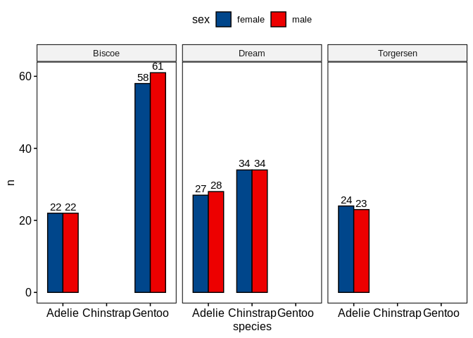

Load data
=========

To start playing around with the functions from these packages we will
use the
[`palmerpenguins`](https://allisonhorst.github.io/palmerpenguins/articles/intro.html)
data set. This simple data set has both continuous and categorical
variables that make it perfect for showcasing how different functions
work.

    require(dplyr)
    require(tidyr)

    penguins_url = 'https://raw.githubusercontent.com/allisonhorst/palmerpenguins/master/inst/extdata/penguins.csv'
    dat = read.csv(url(penguins_url), stringsAsFactors = TRUE)
    dat = dat %>% drop_na()
    head(dat)

    ##   species    island bill_length_mm bill_depth_mm flipper_length_mm body_mass_g
    ## 1  Adelie Torgersen           39.1          18.7               181        3750
    ## 2  Adelie Torgersen           39.5          17.4               186        3800
    ## 3  Adelie Torgersen           40.3          18.0               195        3250
    ## 4  Adelie Torgersen           36.7          19.3               193        3450
    ## 5  Adelie Torgersen           39.3          20.6               190        3650
    ## 6  Adelie Torgersen           38.9          17.8               181        3625
    ##      sex year
    ## 1   male 2007
    ## 2 female 2007
    ## 3 female 2007
    ## 4 female 2007
    ## 5   male 2007
    ## 6 female 2007

General plotting with `ggpubr`
==============================

    require(ggpubr)
    require(ggplot2)

`ggpubr` allows to make insightful plots quickly for exploration that in
turn can be further customized thanks to being built on top of
`ggplot2`.

These are useful links for using this package:

-   [function
    reference](http://rpkgs.datanovia.com/ggpubr/reference/index.html)
-   [palettes](http://rpkgs.datanovia.com/ggpubr/reference/get_palette.html)
-   [figure
    making](http://rpkgs.datanovia.com/ggpubr/reference/ggarrange.html)

Next, we will try to answer different questions using this library and
`ggplot2`.

How many penguins of each species did we observe in total?
----------------------------------------------------------

    ggpie(dat %>% count(species), x = 'n', fill = 'species')

How many penguins of each species and sex did we observe across the different islands?
--------------------------------------------------------------------------------------

    ggbarplot(dat %>% count(species, sex, island), x = 'species', y = 'n', fill = 'sex', 
              label = TRUE, position = position_dodge(0.7), facet.by = 'island', palette = 'lancet')

What are the distributions of flipper lengths considering penguin species, sex and islands of origin?
-----------------------------------------------------------------------------------------------------

    gghistogram(dat, x = 'flipper_length_mm', fill = 'sex', facet.by = c('species','island'))

Alternatively, we can use stripcharts charts:

    ggstripchart(dat, x = 'island', y = 'flipper_length_mm', color = 'sex', facet.by = 'species', alpha = 0.5, position = position_jitterdodge(), add = 'median_iqr', add.params = list(color='black', group='sex', size=0.2))

Are the differences of body mass between sexes significant if we control for species and island?
------------------------------------------------------------------------------------------------

    ggstripchart(dat, x = 'island', y = 'body_mass_g', color = 'sex', facet.by = 'species', alpha = 0.5, position = position_jitterdodge(), add = 'median_iqr', add.params = list(color='black', group='sex', size=0.2))+
       stat_compare_means(aes(color = sex), label = "p.signif", method = 'wilcox.test')

What is the relationship between flipper length, body mass and bill length?
---------------------------------------------------------------------------

    ggscatter(dat, x = 'flipper_length_mm', y = 'body_mass_g', color = 'bill_length_mm', alpha = 0.5)

Could we have sampling bias in the relationship between flipper length and body mass?
-------------------------------------------------------------------------------------

    ggscatter(dat %>% mutate(year=factor(year)), x = 'flipper_length_mm', y = 'body_mass_g', alpha = 0.5, color = 'year', ellipse = TRUE)

What is the spearman correlation coefficient between body mass and flipper length?
----------------------------------------------------------------------------------

    ggscatter(dat %>% mutate(year=factor(year)), x = 'flipper_length_mm', y = 'body_mass_g', alpha = 0.5, color = 'year', 
              add = 'reg.line', conf.int = TRUE, 
              cor.coef = TRUE,
              cor.coeff.args = list(method = 'spearman', label.sep = '\n')) + 
       theme(aspect.ratio = 1)

Create and save a figure
------------------------

    fontsize = 6
    labsize = 2

    # overview number of observations of every sex across islands and species
    p1 = ggbarplot(dat %>% count(species, sex, island), x = 'species', y = 'n', fill = 'sex', 
                   label = TRUE, lab.size = labsize,
                   position = position_dodge(0.7), facet.by = 'island', palette = 'lancet') + 
       ylim(NA, 68)

    # sex-related body mass distributions across islands and species
    p2 = ggstripchart(dat, x = 'island', y = 'body_mass_g', color = 'sex', facet.by = 'species', 
                      alpha = 0.5, position = position_jitterdodge(), add = 'median_iqr', 
                      add.params = list(color='black', group='sex', size=0.2),
                      palette = 'lancet')+
                stat_compare_means(aes(color = sex), label = "p.signif", method = 'wilcox.test', size = labsize)

    # association of flipper length and body mass
    p3 = ggscatter(dat %>% mutate(year=factor(year)), x = 'flipper_length_mm', y = 'body_mass_g', alpha = 0.5, color = 'year', 
              add = 'reg.line', conf.int = TRUE, 
              cor.coef = TRUE,
              cor.coeff.args = list(method = 'spearman', label.sep = '\n', size = labsize)) + 
       theme(aspect.ratio = 1)

    p1p2 = ggarrange(p1 + theme_pubr(base_size = fontsize), p2 + theme_pubr(base_size = fontsize), ncol = 1, common.legend = TRUE)
    fig = ggarrange(p1p2, p3 + theme_pubr(base_size = fontsize), widths = c(2,1), heights = c(2, 1), labels = 'AUTO')

    # save
    ggsave('images/myfig.png', fig, width = 15, height = 10, unit = 'cm')

Heatmaps with `pheatmap`
========================

A part from `ggpubr`, one of the most common packages to visualize
multiple types of data altogether is `pheatmap`, which allows to combine
hierarchical clustering of rows and columns with continuous and
categorical data.

    require(pheatmap)
    # we are only interested in numeric columns
    cols_oi = c('bill_length_mm','bill_depth_mm','flipper_length_mm','body_mass_g')
    rownames(dat) = 1:nrow(dat)
    pheatmap(dat[,cols_oi], scale = 'column', show_rownames = FALSE, annotation_row = dat[,c('species','island'),drop=FALSE])

Phylogenetic trees with `ggtree`
================================

Trees are another very common plot to visualize hierarchical patterns.
Here, we will use
[`ggtree`](https://guangchuangyu.github.io/ggtree-book/chapter-ggtree.html)
to visualize the phylogenetic relationships extracted from a multiple
sequence alignment of *TP53* across mammals.

Basic tree
----------

    require(ggtree)
    set.seed(100)
    tree <- rtree(50)
    ggtree(tree, layout="circular") + geom_tiplab()

Tree and multiple sequence alignment of *TP53* amino acids
----------------------------------------------------------

We will follow [Russell J.
Gray](https://github.com/RussellGrayxd/Phylogenetics/blob/master/Sequence%20analysis.R)’s
approach.

    require(seqinr)
    require(ape)

    # create tree from alignment
    fasta_file = file.path(here::here(), 'data', 'raw', 'TP53-mammals-alignment-aa.fa')
    aln = read.alignment(fasta_file, format = 'fasta', whole.header=TRUE)
    D = dist.alignment(aln)
    tree = njs(D)

    # plot tree with MSA
    tree_plot = ggtree(tree)
    msaplot(tree_plot, fasta = fasta_file) + ggtitle('tree with MSA')

References
==========

-   [`ggplot2`](https://ggplot2.tidyverse.org/)
-   [`ggpubr`](https://rpkgs.datanovia.com/ggpubr/)
-   [`pheatmap`](https://cran.r-project.org/web/packages/pheatmap/index.html)
-   [`ggtree`](https://guangchuangyu.github.io/ggtree-book/chapter-ggtree.html)
-   [`seqinr`](https://seqinr.r-forge.r-project.org/)
-   [`ape`](https://www.rdocumentation.org/packages/ape/versions/5.4-1)
-   [`Biostrings`](https://bioconductor.org/packages/release/bioc/html/Biostrings.html)
-   [`Russell J. Gray's github`](https://github.com/RussellGrayxd)

Session Info
============

    sessionInfo()

    ## R version 4.0.3 (2020-10-10)
    ## Platform: x86_64-pc-linux-gnu (64-bit)
    ## Running under: Ubuntu 18.04.5 LTS
    ## 
    ## Matrix products: default
    ## BLAS:   /usr/lib/x86_64-linux-gnu/blas/libblas.so.3.7.1
    ## LAPACK: /usr/lib/x86_64-linux-gnu/lapack/liblapack.so.3.7.1
    ## 
    ## locale:
    ##  [1] LC_CTYPE=en_US.UTF-8       LC_NUMERIC=C              
    ##  [3] LC_TIME=es_ES.UTF-8        LC_COLLATE=en_US.UTF-8    
    ##  [5] LC_MONETARY=es_ES.UTF-8    LC_MESSAGES=en_US.UTF-8   
    ##  [7] LC_PAPER=es_ES.UTF-8       LC_NAME=C                 
    ##  [9] LC_ADDRESS=C               LC_TELEPHONE=C            
    ## [11] LC_MEASUREMENT=es_ES.UTF-8 LC_IDENTIFICATION=C       
    ## 
    ## attached base packages:
    ## [1] stats     graphics  grDevices utils     datasets  methods   base     
    ## 
    ## other attached packages:
    ## [1] ape_5.4-1       seqinr_4.2-5    ggtree_2.4.1    pheatmap_1.0.12
    ## [5] ggpubr_0.4.0    ggplot2_3.3.3   tidyr_1.1.2     dplyr_1.0.4    
    ## 
    ## loaded via a namespace (and not attached):
    ##  [1] jsonlite_1.7.2      splines_4.0.3       carData_3.0-4      
    ##  [4] here_1.0.1          stats4_4.0.3        BiocManager_1.30.10
    ##  [7] rvcheck_0.1.8       highr_0.8           cellranger_1.1.0   
    ## [10] yaml_2.2.1          progress_1.2.2      pillar_1.4.7       
    ## [13] backports_1.2.1     lattice_0.20-41     glue_1.4.2         
    ## [16] digest_0.6.27       XVector_0.30.0      RColorBrewer_1.1-2 
    ## [19] ggsignif_0.6.0      colorspace_2.0-0    cowplot_1.1.1      
    ## [22] htmltools_0.5.1.1   Matrix_1.3-2        pkgconfig_2.0.3    
    ## [25] broom_0.7.4         haven_2.3.1         zlibbioc_1.36.0    
    ## [28] purrr_0.3.4         patchwork_1.1.1     tidytree_0.3.3     
    ## [31] scales_1.1.1        openxlsx_4.2.3      rio_0.5.16         
    ## [34] tibble_3.0.6        mgcv_1.8-33         IRanges_2.24.1     
    ## [37] generics_0.1.0      farver_2.0.3        car_3.0-10         
    ## [40] ellipsis_0.3.1      withr_2.4.1         BiocGenerics_0.36.0
    ## [43] lazyeval_0.2.2      magrittr_2.0.1      crayon_1.4.1       
    ## [46] readxl_1.3.1        evaluate_0.14       nlme_3.1-152       
    ## [49] MASS_7.3-53         rstatix_0.6.0       forcats_0.5.1      
    ## [52] foreign_0.8-81      tools_4.0.3         data.table_1.13.6  
    ## [55] prettyunits_1.1.1   hms_1.0.0           lifecycle_0.2.0    
    ## [58] stringr_1.4.0       S4Vectors_0.28.1    aplot_0.0.6        
    ## [61] munsell_0.5.0       ggsci_2.9           zip_2.1.1          
    ## [64] Biostrings_2.58.0   ade4_1.7-16         compiler_4.0.3     
    ## [67] rlang_0.4.10        grid_4.0.3          labeling_0.4.2     
    ## [70] rmarkdown_2.6       gtable_0.3.0        abind_1.4-5        
    ## [73] curl_4.3            R6_2.5.0            gridExtra_2.3      
    ## [76] knitr_1.31          rprojroot_2.0.2     treeio_1.14.3      
    ## [79] stringi_1.5.3       parallel_4.0.3      Rcpp_1.0.6         
    ## [82] vctrs_0.3.6         tidyselect_1.1.0    xfun_0.20
