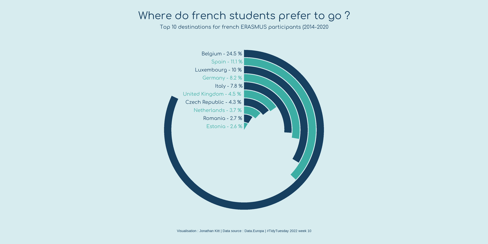

# Customize every detail

# Load data


One of the greatest things of R data visualization is its community.
There are many open-source projects going on that revolve around getting started and improving our data viz skills.
One of my favorite projects is [`tidytuesday`](https://github.com/rfordatascience/tidytuesday), a challenge consisting of sharing toy datasets, plotting them and posting them together with the corresponding code on twitter with the hashtag [#tidytuesday](https://twitter.com/search?q=%23tidytuesday&src=typed_query).
They even share [videos](https://www.youtube.com/watch?v=F4c-rEFfJpQ) on how to reproduce plots made by others just by looking at their final plot!
I think this is a great resource to get inspired, getting to know new possibilities, and training.
There are people that have made this a weekly ritual!
I recommend you to follow [this twitter bot](https://twitter.com/TidyTuesday_Bot) to check out people's ideas.
One of my favorite R plotters is [`Cedric Scherer`](https://www.cedricscherer.com/), who has become a guru of data visualization.
Check out his webpage!

Here, we will use the toy dataset from 2022/03/08 on [EU student mobility](https://github.com/rfordatascience/tidytuesday/tree/master/data/2022/2022-03-08), describing the movements of students throughout the ERASMUS program.

```{r, message=FALSE, warning=FALSE}
require(tidyverse)
require(ggpubr)

dat_url = "https://raw.githubusercontent.com/rfordatascience/tidytuesday/master/data/2022/2022-03-08/erasmus.csv"
dat = read_csv(dat_url)
dat %>% head(1) %>% t()
```

# Explore the data using the functions introduced.

Freestyle time!
Try out the functions from `ggpubr` that we introduced earlier to get some answers from this dataset (e.g. what is the most common connection?).

```{r}

```

# `ggplot2` in depth: [`@KittJonathan`](https://twitter.com/KittJonathan)'s version

To exemplify how projects like `tidytuesday` can help us learning new ways of plotting in R, I have copy-pasted [`@KittJonathan`](https://twitter.com/KittJonathan)'s version of the challenge: <https://github.com/KittJonathan/tidytuesday/blob/master/R/2022_03_08_erasmus.R>.
In this github page you'll find many more cool visualizations!

**NOTE**: you'll need to install several extra packages to be able to run it:

-   [`showtext`](https://cran.rstudio.com/web/packages/showtext/vignettes/introduction.html): edit fonts more easily in R graphs.
-   [`countrycode`](https://cran.r-project.org/web/packages/countrycode/index.html): get country code names.

```{r, message=FALSE, warning=FALSE}
erasmus = dat

require(showtext)
require(countrycode)

# get the code from the repository and try changing some parameters
```



# References

-   [`tidytuesday`](https://github.com/rfordatascience/tidytuesday)
-   [`Cedric Scherer`](https://www.cedricscherer.com/)

# Session Info

```{r session info}
sessionInfo()
```
