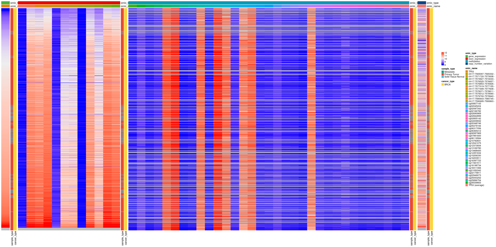

# Exploratory Data Analysis of the most popular human gene
# Data
```{r, message=FALSE, warning=FALSE}
require(tidyverse)
require(ggpubr)
require(ComplexHeatmap)

ROOT = here::here()
```

## Description
According to this [article](https://www.nature.com/articles/d41586-017-07291-9), *TP53* is the most popular gene in the human genome by far.
In the practical part of the talk, we will all dive into pubicly available data on this gene.


We collected harmonized multi-omic data from the XenaBrowser's [TCGA Pan Cancer (PANCAN) dataset](https://xenabrowser.net/datapages/?cohort=TCGA%20Pan-Cancer%20(PANCAN)&removeHub=https%3A%2F%2Fxena.treehouse.gi.ucsc.edu%3A443):

- Gene expression: log2(norm_value+1)
- Exon expression: log2(RPKM+1)
- Gene methylation 450k: beta value
- Copy Number Variation: log( tumor / normal )
- Mutations

Additionally, we downloaded a protein Multiple Sequence Alignment (MSA) of 153 *TP53* mammal orthologues from [NCBI](https://www.ncbi.nlm.nih.gov/), generated through their aligner [COBALT](https://www.ncbi.nlm.nih.gov/gene/7157/ortholog/?scope=40674).


## Overview
The pre-processed data sets can be found in `data/prep`.
```{r, warning=FALSE, message=FALSE}
omics = read_tsv(file.path(ROOT,'data','prep','data_multiomics.tsv.gz'))
muts = read_tsv(file.path(ROOT,'data','prep','data_somatic_mutations.tsv.gz'))
```

The data sets contain data on all these cancer types:
```{r}
omics %>% distinct(cancer_type) %>% pull()
```


I pre-processed different omic data sets into a long format data frame in which every "value" is linked to an "omic_type", which in turn can have several "omic_names". Additionally, we added information on the sample metadata.
```{r}
# available variables
colnames(omics)
# omic data types
omics %>% group_by(omic_type) %>% count()
```

In the cases of exon expression and methylation, there are multiple "omic_name"s that correspond to different exons and methylation sites.

```{r}
# exons
omics %>% filter(omic_type=='exon_expression') %>% distinct(omic_name) %>% pull()

# methylation sites
omics %>% filter(omic_type=='methylation') %>% distinct(omic_name) %>% pull()
```

Then, the mutations data set is structured as a list of mutations that occur inthis gene in every sample:
```{r}
colnames(muts)
```

```{r}
muts %>% drop_na(effect)
```


# Exploratory Data Analysis
In this section, we will try to answer the questions using functions from the packages introduced previously. These solutions are completely subjective, so feel free to find your own best ways of combining and visualizing the different types of data.


## Counting
### How many samples per cancer type are there?
```{r}
# try ggbarplot()
```

### How many samples per cancer type and sample type are there?
```{r, fig.width=10, fig.height=4}
# try ggbarplot()
```

## Distributions
### What are the distributions of values for every omic type across cancer types?
```{r}
# try ggboxplot()
```

### Could you now split them by sample type?
```{r}
# try ggboxplot()
```

### Can you find a type of omic with statistically different values across cancer types when comparing "Primary Tumor" vs. "Solid Tissue Normal" sample types?
```{r}
# try ggboxplot() with stat_compare_means()
```

## Mutations
### How many samples have at least a mutation?
```{r}
# no plot needed, just data wrangling
```

### Which are the most common effects of mutations?
```{r}
# try ggbarplot()
```

### How are mutation effects associated to certain positions? And cancer_types?
```{r, fig.width=8, fig.height=8, message=FALSE, warning=FALSE}
# try gghistogram()
```

## Pairwise associations
### Could mutation effects be associated with gene expression?
```{r}
# you'll need some data wrangling
# try ggboxplot()
```

### Could gene expression be associated with copy number variation?
```{r fig.width=8, fig.height=8, message=FALSE, warning=FALSE}
# try ggscatter()
```

### Visualize other pairwise associations that you found interesting
Try to visualize them considering different sample types, cancer types and omic types and names.

## Generating data overviews
### Could you use `ComplexHeatmap` to get an overview of the distributions of every omic type across samples? Could you also include "cancer_type" and "omic_name" as row and column annotations?
```{r}
# subset by cancer types (my computer does not have enough memory)
# prepare annotations
# prepare matrix of values, sorted by gene expression
# prepare annotation colors
# for every omic type
# save plots in "plts" object
## get omic names corresponding to this omic type
## build annotations with HeatmapAnnotation()
## try Heatmap()
```


```{r, warning=FALSE, message=FALSE, results='hide'}
png('images/heatmaps.png', height = 400, width = 800, units = 'mm', res = 100)
plts[['gene_expression']] + plts[['exon_expression']] + plts[['methylation']] + plts[['copy_number_variation']]
dev.off()
```



# References
- [Article on the most popular genes.](https://www.nature.com/articles/d41586-017-07291-9)
- [XenaBrowser](https://xenabrowser.net/)
- [NCBI](https://www.ncbi.nlm.nih.gov/)


# Session Info
```{r session info}
sessionInfo()
```