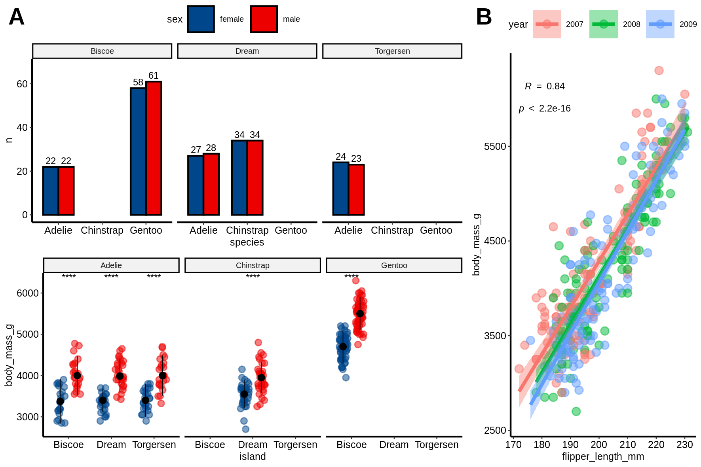

# Introduction
# Load data


To start playing around with the functions from these packages we will use the [`palmerpenguins`](https://allisonhorst.github.io/palmerpenguins/articles/intro.html) data set.
This simple data set has both continuous and categorical variables that make it perfect for showcasing how different functions work.

```{r, message=FALSE, warning=FALSE}
require(tidyverse)

penguins_url = "https://raw.githubusercontent.com/allisonhorst/palmerpenguins/master/inst/extdata/penguins.csv"
dat = read_csv(url(penguins_url))
dat = dat %>% drop_na()
head(dat)
```

# General plotting with `ggpubr`
```{r message=FALSE, warning=FALSE}
require(ggpubr)
```

`ggpubr` allows to make insightful plots quickly for exploration that in turn can be further customized thanks to being built on top of `ggplot2`.

These are useful links for using this package:

- [function reference](http://rpkgs.datanovia.com/ggpubr/reference/index.html)
- [palettes](http://rpkgs.datanovia.com/ggpubr/reference/get_palette.html)
- [figure making](http://rpkgs.datanovia.com/ggpubr/reference/ggarrange.html)

Next, we will try to answer different questions using this library and `ggplot2`.

## How many penguins of each species did we observe in total?
```{r}
ggpie(dat %>% count(species), x = "n", fill = "species")
```

## How many penguins of each species and sex did we observe across the different islands?
```{r}
ggbarplot(dat %>% count(species, sex, island), x = "species", y = "n", fill = "sex", 
          label = TRUE, position = position_dodge(0.7), facet.by = "island", palette = "lancet")
```


## What are the distributions of flipper lengths considering penguin species, sex and islands of origin?
```{r, message=FALSE, warning=FALSE}
gghistogram(dat, x = "flipper_length_mm", fill = "sex", facet.by = c("species","island"))
```

Alternatively, we can use stripcharts charts:
```{r}
ggstripchart(dat, x = "island", y = "flipper_length_mm", color = "sex", facet.by = "species", alpha = 0.5, position = position_jitterdodge(), add = "median_iqr", add.params = list(color="black", group="sex", size=0.2))
```

## Are the differences of body mass between sexes significant if we control for species and island?
```{r}
ggstripchart(dat, x = "island", y = "body_mass_g", color = "sex", facet.by = "species", alpha = 0.5, position = position_jitterdodge(), add = "median_iqr", add.params = list(color="black", group="sex", size=0.2))+
   stat_compare_means(aes(color = sex), label = "p.signif", method = "wilcox.test")
```

## What is the relationship between flipper length, body mass and bill length?
```{r}
ggscatter(dat, x = "flipper_length_mm", y = "body_mass_g", color = "bill_length_mm", alpha = 0.5)
```

## Could we have sampling bias in the relationship between flipper length and body mass?
```{r}
ggscatter(dat %>% mutate(year=factor(year)), x = "flipper_length_mm", y = "body_mass_g", alpha = 0.5, color = "year", ellipse = TRUE)
```

## What is the spearman correlation coefficient between body mass and flipper length?
```{r, message=FALSE, warning=FALSE}
ggscatter(dat %>% mutate(year=factor(year)), x = "flipper_length_mm", y = "body_mass_g", alpha = 0.5, color = "year", 
          add = "reg.line", conf.int = TRUE, 
          cor.coef = TRUE,
          cor.coeff.args = list(method = "spearman", label.sep = "\n")) + 
   theme(aspect.ratio = 1)
```

## Create and save a figure
```{r, warning=FALSE, message=FALSE}
fontsize = 6
labsize = 2

# overview number of observations of every sex across islands and species
p1 = ggbarplot(dat %>% count(species, sex, island), x = "species", y = "n", fill = "sex", 
               label = TRUE, lab.size = labsize,
               position = position_dodge(0.7), facet.by = "island", palette = "lancet") + 
   ylim(NA, 68)

# sex-related body mass distributions across islands and species
p2 = ggstripchart(dat, x = "island", y = "body_mass_g", color = "sex", facet.by = "species", 
                  alpha = 0.5, position = position_jitterdodge(), add = "median_iqr", 
                  add.params = list(color="black", group="sex", size=0.2),
                  palette = "lancet")+
            stat_compare_means(aes(color = sex), label = "p.signif", method = "wilcox.test", size = labsize)

# association of flipper length and body mass
p3 = ggscatter(dat %>% mutate(year=factor(year)), x = "flipper_length_mm", y = "body_mass_g", alpha = 0.5, color = "year", 
          add = "reg.line", conf.int = TRUE, 
          cor.coef = TRUE,
          cor.coeff.args = list(method = "spearman", label.sep = "\n", size = labsize)) + 
   theme(aspect.ratio = 1)


p1p2 = ggarrange(p1 + theme_pubr(base_size = fontsize), p2 + theme_pubr(base_size = fontsize), ncol = 1, common.legend = TRUE)
fig = ggarrange(p1p2, p3 + theme_pubr(base_size = fontsize), widths = c(2,1), heights = c(2, 1), labels = "AUTO")

# save
ggsave("images/myfig.png", fig, width = 15, height = 10, unit = "cm")
```



# Heatmaps with `ComplexHeatmap`
A part from `ggpubr`, one of the most common packages to visualize multiple types of data altogether is `ComplexHeatmap`, which allows to combine hierarchical clustering of rows and columns with continuous and categorical data.

```{r message=FALSE, warning=FALSE}
require(ComplexHeatmap)
# we are only interested in numeric columns
cols_oi = c("bill_length_mm","bill_depth_mm","flipper_length_mm","body_mass_g")
rownames(dat) = 1:nrow(dat)

# we need to add as.data.frame() because "dat" is a tibble,
# which differ in the way they handle data underlying data types
annotation_row = HeatmapAnnotation(df=dat[,c("island","species")] %>% as.data.frame(),
                                   name="metadata_row",
                                   which="row")

mat = dat[,cols_oi] %>% as.matrix()
mat = scale(mat)
Heatmap(mat, 
        name="zscore",
        show_row_names = FALSE, 
        right_annotation = annotation_row)
```

# References
- [`ggplot2`](https://ggplot2.tidyverse.org/)
- [`ggpubr`](https://rpkgs.datanovia.com/ggpubr/)
- [`ComplexHeatmap`](http://bioconductor.org/packages/release/bioc/html/ComplexHeatmap.html)

# Session Info
```{r session info}
sessionInfo()
```