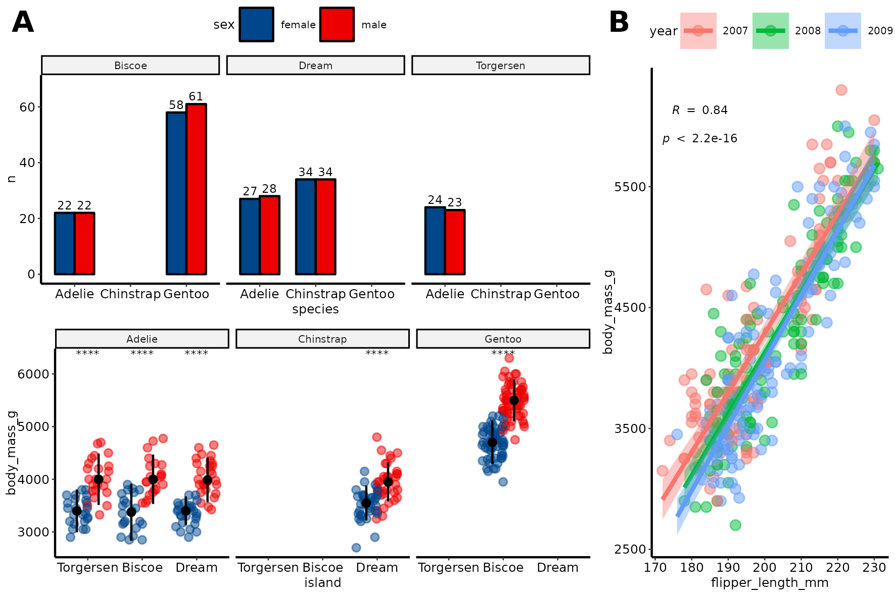

# Get started
# Load data


To start playing around with the functions from these packages we will use the [`palmerpenguins`](https://allisonhorst.github.io/palmerpenguins/articles/intro.html) data set.
This simple data set has both continuous and categorical variables that make it perfect for showcasing how different functions work.

```{r, message=FALSE, warning=FALSE}
require(tidyverse)

penguins_url = "https://raw.githubusercontent.com/allisonhorst/palmerpenguins/master/inst/extdata/penguins.csv"
dat = read_csv(url(penguins_url))
dat = dat %>% drop_na()
head(dat)
```

# General plotting with `ggpubr`
```{r message=FALSE, warning=FALSE}
require(ggpubr)
```

`ggpubr` allows to make insightful plots quickly for exploration that in turn can be further customized thanks to being built on top of `ggplot2`.

These are useful links for using this package:

- [function reference](http://rpkgs.datanovia.com/ggpubr/reference/index.html)
- [palettes](http://rpkgs.datanovia.com/ggpubr/reference/get_palette.html)
- [figure making](http://rpkgs.datanovia.com/ggpubr/reference/ggarrange.html)

Next, we will try to answer different questions using this library and `ggplot2`.

## How many penguins of each species did we observe in total?
```{r}
# try ggpie()
```

## How many penguins of each species and sex did we observe across the different islands?
```{r}
# try ggbarplot()
```


## What are the distributions of flipper lengths considering penguin species, sex and islands of origin?
```{r, message=FALSE, warning=FALSE}
# try gghistogram()
```

Alternatively, we can use stripcharts charts:
```{r}
# try ggstripchart()
```

## Are the differences of body mass between sexes significant if we control for species and island?
```{r}
# ggstripchart() and stat_compare_means()
```

## What is the relationship between flipper length, body mass and bill length?
```{r}
# ggscatter()
```

## Could we have sampling bias in the relationship between flipper length and body mass?
```{r}
# try ggscatter()'s fill option
```

## What is the spearman correlation coefficient between body mass and flipper length?
```{r, message=FALSE, warning=FALSE}
# try ggscatter() with "cor.coef" and "add" options
```

## Create and save a figure
```{r, warning=FALSE, message=FALSE}
# try ggarrange() and ggsave()
```



# Heatmaps with `ComplexHeatmap`
A part from `ggpubr`, one of the most common packages to visualize multiple types of data altogether is `ComplexHeatmap`, which allows to combine hierarchical clustering of rows and columns with continuous and categorical data.

```{r message=FALSE, warning=FALSE}
require(ComplexHeatmap)
```

# References
- [`ggplot2`](https://ggplot2.tidyverse.org/)
- [`ggpubr`](https://rpkgs.datanovia.com/ggpubr/)
- [`ComplexHeatmap`](http://bioconductor.org/packages/release/bioc/html/ComplexHeatmap.html)

# Session Info
```{r session info}
sessionInfo()
```