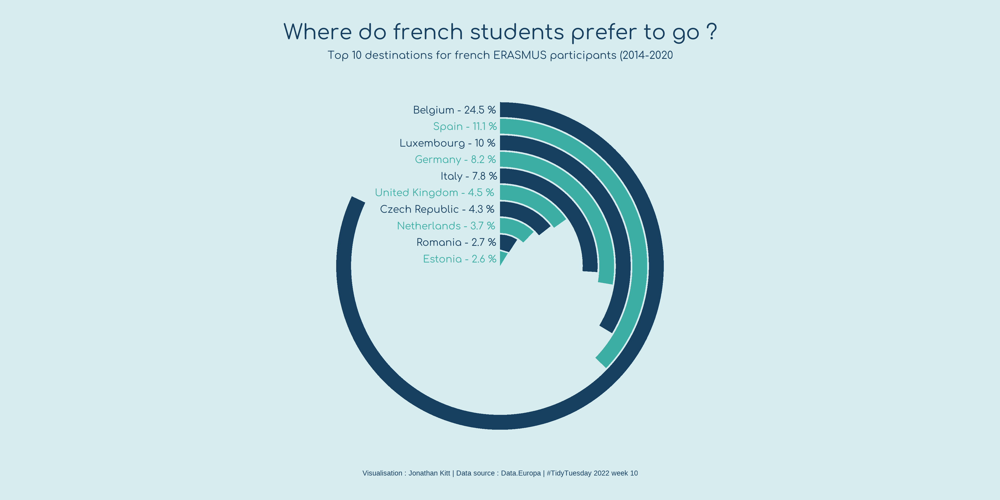

# The R data viz community
# Load data


One of the greatest things of R data visualization is its community.
There are many open-source projects going on that revolve around getting started and improving our data viz skills.
One of my favorite projects is [`tidytuesday`](https://github.com/rfordatascience/tidytuesday), a challenge consisting of sharing toy datasets, plotting them and posting them together with the corresponding code on twitter with the hashtag [#tidytuesday](https://twitter.com/search?q=%23tidytuesday&src=typed_query).
They even share [videos](https://www.youtube.com/watch?v=F4c-rEFfJpQ) on how to reproduce plots made by others just by looking at their final plot!
I think this is a great resource to get inspired, getting to know new possibilities, and training.
There are people that have made this a weekly ritual!
I recommend you to follow [this twitter bot](https://twitter.com/TidyTuesday_Bot) to check out people's ideas.
One of my favorite R plotters is [`Cedric Scherer`](https://www.cedricscherer.com/), who has become a guru of data visualization.
Check out his webpage!


Here, we will use the toy dataset from 2022/03/08 on [EU student mobility](https://github.com/rfordatascience/tidytuesday/tree/master/data/2022/2022-03-08), describing the movements of students throughout the ERASMUS program.

```{r, message=FALSE, warning=FALSE}
require(tidyverse)
require(ggpubr)

dat_url = "https://raw.githubusercontent.com/rfordatascience/tidytuesday/master/data/2022/2022-03-08/erasmus.csv"
dat = read_csv(dat_url)
dat %>% head(1) %>% t()
```
# Explore the data using the functions introduced.
Freestyle time! Try out the functions from `ggpubr` that we introduced earlier to get some answers from this dataset (e.g. what is the most common connection?).

```{r}
# mobility troughout years and months by gender
plt = dat %>% 
    mutate(month=gsub(".*-","", mobility_start_month)) %>% 
    count(academic_year, month, participant_gender) %>% 
    ggbarplot(x="month", y="n", fill="participant_gender", palette="simpsons", 
              facet.by="academic_year", position=position_dodge(0.5), color=NA) + 
    labs(x="Month", y="Count", fill="")

plt
```
# `ggplot2` in depth: [@KittJonathan](https://twitter.com/KittJonathan)'s version
To exemplify how projects like `tidytuesday` can help us learning new ways of plotting in R, I have copy-pasted [@KittJonathan](https://twitter.com/KittJonathan)'s version of the challenge: https://github.com/KittJonathan/tidytuesday/blob/master/R/2022_03_08_erasmus.R. 
In this github page you'll find many more cool visualizations!

**NOTE**: you'll need to install several extra packages to be able to run it:
- [`showtext`](https://cran.rstudio.com/web/packages/showtext/vignettes/introduction.html): edit fonts more easily in R graphs.
- [`countrycode`](https://cran.r-project.org/web/packages/countrycode/index.html): get country code names.


```{r}
erasmus = dat

require(showtext)
require(countrycode)

# Load fonts ----

font_add_google(name = "Comfortaa", family = "Comfortaa")
showtext_auto()

# Data wrangling ----

country_codes <- codelist %>%
  select(iso2c, country_name = country.name.en)

d1 <- erasmus %>% 
  filter(participant_nationality == "FR",  # keep data for french students
         receiving_country_code != "FR") %>%  # keep mobilities abroad
  select(receiving_country_code, participants) %>%   # remove unwanted columns
  left_join(country_codes, by = c("receiving_country_code" = "iso2c")) %>%  # add sending country name
  mutate(country_name = case_when(receiving_country_code == "EL" ~ "Greece",  # add missing country names 
                                  receiving_country_code == "UK" ~ "United Kingdom",
                                  receiving_country_code == "CZ" ~ "Czech Republic",
                                  TRUE ~ country_name)) %>% 
  group_by(country_name) %>%  # group data by country name
  mutate(total = sum(participants)) %>%   # count total number of participants for each receiving country
  filter(row_number() == 1) %>%  # keep 1 row by receiving country
  arrange(desc(total)) %>%   # arrange data by descending order
  ungroup() %>%  # ungroup data
  mutate(percent = 100 * total / sum(total)) %>%   # calculate ratio
  mutate(country_name = factor(country_name, levels = rev(country_name))) %>%  # set levels %>% 
  head(10)  # keep top 10 destinations

# Create plot ----

p <- ggplot(data = d1,
       aes(x = country_name, y = total, fill = country_name)) +
  geom_bar(width = 0.9, stat = "identity", show.legend = FALSE) +
  scale_fill_manual(values = rep(c("#3caea3", "#173f5f"), 5)) +
  coord_polar(theta = "y", start = 0) +
  xlab("") +
  ylab("") +
  labs(caption = "Visualisation : Jonathan Kitt | Data source : Data.Europa | #TidyTuesday 2022 week 10") +
  geom_text(aes(x = country_name, y = 0, label = paste0(country_name, " - ", round(percent, digits = 1), " %")),
            hjust = 1.05, family = "Comfortaa", size = 10, colour = rep(c("#173f5f", "#3caea3"), 5)) +
  ggtitle(label = "Where do french students prefer to go ?",
          subtitle = "Top 10 destinations for french ERASMUS participants (2014-2020") +
  ylim(c(0, 250)) +
  theme_void() +
  theme(plot.background = element_rect(fill = "#d6ecef", colour = "#d6ecef"),
        panel.background = element_rect(fill = "#d6ecef", colour = "#d6ecef"),
        plot.title = element_text(family = "Comfortaa", size = 60, colour = "#173f5f", hjust = 0.5,
                                  margin = margin(t = 20)),
        plot.subtitle = element_text(family = "Comfortaa", size = 30, colour = "#173f5f", hjust = 0.5),
        plot.caption = element_text(colour = "#173f5f", size = 20, hjust = 0.5,
                                    margin = margin(b = 20)))

ggsave("images/2022_03_08_erasmus.png", p, dpi = 320, width = 12, height = 6)
```



# References

-   [`tidytuesday`](https://github.com/rfordatascience/tidytuesday)
-   [`Cedric Scherer`](https://www.cedricscherer.com/)

# Session Info

```{r session info}
sessionInfo()
```
